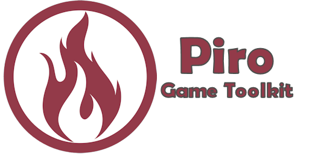

<a href="https://tinybiggames.com" target="_blank"></a>

[](https://discord.gg/tPWjMwK) [](https://github.com/tinyBigGAMES/Pla/stargazers) [](https://github.com/tinyBigGAMES/Pla/network/members) [](https://github.com/tinyBigGAMES/Pla/network/members)
[](https://twitter.com/tinyBigGAMES)

## Overview
Pla Game Toolkit&trade; is 2D indie SDK that allow you to do game development in <a href="https://www.embarcadero.com/products/delphi" target="_blank">Delphi</a> for desktop PC's running Microsoft Windows® and uses Direct3D® for hardware accelerated rendering.

It's robust, designed for easy, fast & fun use an suitable for making all types of 2D games and other graphic simulations, You access the features from a simple and intuitive API, to allow you to rapidly and efficiently develop your projects. There is support for bitmaps, audio samples, streaming music, video playback, loading resources directly from a standard ZIP archive, a thin object oriented actor/scene system, entity state machine, sprite management, PolyPoint&trade; collision detection and much more. GameVision, easy, fast & fun!

## Downloads
<a href="https://tinybiggames.com/temp/PGT-Dev.zip" target="_blank">**Development**</a> - This build represent the most recent development state an as such may or may not be as stable as the official release versions. If you like living on the bleeding edge, it's updated frequently (often daily) and will contain bug fixes and new features.

<a href="https://github.com/tinyBigGAMES/PlaGameToolkit/releases" target="_blank">**Releases**</a> - These are the official release versions and deemed to be the most stable.

Visit <a href="https://tinybiggames.com" target="_blank">tinyBigGAMES</a> website for the latest news, updates, downloads and licensing information.

## Features
- **Free** for commercial use. See License agreement.
- Written in **Object Pascal**
- Support Windows 64 bit platform
- Hardware accelerated with **OpenGL**
- You interact with the toolkit via **routines**, **class objects** and a thin **OOP framework**
- **Archive** (standard ZIP format, password protection )
- **Display** ( OpenGL, anti-aliasing, vsync, viewports, primitives, blending)
- **Input** (keyboard, mouse and joystick)
- **Bitmap** (color key transparency, scaling, rotation, flipped, titled,  BMP, DDS, PCX, TGA, JPEG, PNG)
- **Video** (play, pause, rewind, OGV format)
- **Sprite** (pages, groups, animation, poly-point collision)
- **Entity** (defined from a sprite, position, scale, rotation, collision)
- **Actor** (list, scene, state machine)
- **Audio** (samples, streams, WAV, OGG/Vorbis, FLAC formats)
- **Speech** (multiple voices, play, pause)
- **Font** (true type, scale, rotate, 2 builtin)
- **Timing** (time-based, frame elapsed, frame speed)
- **Shaders** (vertex, pixel, GLSL)
- **Misc** (collision, easing, screenshake, screenshot, starfield, colors, INI based config files, startup dialog, treeview menu)

## Minimum System Requirements
- <a href="https://www.embarcadero.com/products/delphi/starter" target="_blank">Delphi Community Edition+</a>
- Microsoft Windows 10, 64 bits
- OpenGL 3

## How to use in Delphi
- Unzip the archive to a desired location.
- Add `installdir\libs`, folder to Delphi's library path so the toolkit source files can be found for any project or for a specific project add to its search path.
- See examples in the `installdir\examples` for more information about usage.
- Build `PlaArc` utility for making **.ARC** files (standard zip archive). Running the `makearc.bat` in `installdir\examples\bin` will build `Data.arc` that is used by the examples.
- Build `PlaDump` utility if you need convert a small binary file to Pascal source format that can be included `{$I MyBinaryFile.inc}` in your project.
- Build `PlaExamples` to showcase many of the features and capabilities of the toolkit.

## Known Issues
- This project is in active development so changes will be frequent 
- Documentation is WIP. They will continue to evolve
- More examples will continually be added over time

## A Tour of Pla Game Toolkit
### Game Object
You just have to derive a new class from the `TCustomGame` base class and override a few callback methods. You access the toolkit functionality from the `PGT` unit.
```pascal
uses
  PGT;
  
const
  cArchiveFilename   = 'Data.arc';

  cDisplayTitle      = 'MyGame';
  cDisplayWidth      = 800;
  cDisplayHeight     = 480;
  cDisplayFullscreen = False;

type
  { TMyGame }
  TMyGame = class(TCustomGame)
  protected
    FFont: TFont;
  public
    procedure OnLoad; override;
    procedure OnExit; override;
    procedure OnStartup; override;
    procedure OnShutdown; override;
    procedure OnUpdate(aDeltaTime: Double); override;
    procedure OnClearDisplay; override;
    procedure OnShowDisplay; override;
    procedure OnRender; override;
    procedure OnRenderHUD; override;
  end;
```
### How to use
A minimal implementation example:
```pascal
uses
  System.SysUtils;

{ TMyGame }
procedure TMyGame.OnLoad;
begin
  // open archive file
  Pla.Archive.Open(cArchiveFilename);
end;

procedure TMyGame.OnExit;
begin
  // close archive file
  Pla.Archive.Close(cArchiveFilename);
end;

procedure TMyGame.OnStartup;
begin
  // open display
  Pla.Display.Open(cDisplayWidth, cDisplayHeight,  cDisplayFullscreen, cDisplayTitle);

  // create font, use buildin
  FFont := Pla.Font.New;
end;

procedure TMyGame.OnShutdown;
begin
  // free font
  Pla.Font.Free(FFont);

  // close display
  Pla.Display.Close;
end;

procedure TMyGame.OnUpdate(aDeltaTime: Double);
begin
  // process input
  if Pla.Input.KeyboardPressed(KEY_ESCAPE) then
    Pla.SetTerminate(True);
end;

procedure TMyGame.OnClearDisplay;
begin
  // clear display
  Pla.Display.Clear(BLACK);
end;

procedure TMyGame.OnShowDisplay;
begin
  // show display
  Pla.Display.Show;
end;

procedure TMyGame.OnRender;
begin
  // render any graphics here
end;

procedure TMyGame.OnRenderHUD;
var
  Pos: TVector;
begin
  // assign hud start pos
  Pos.Assign(3, 3, 0);

  // display hud text
  Pla.Font.Print(FFont, Pos.X, Pos.Y, Pos.Z, WHITE, alLeft, 'fps %d', [Pla.GetFrameRate]);
  Pla.Font.Print(FFont, Pos.X, Pos.Y, 0, GREEN, alLeft, 'Esc - Quit', []);
end;
```
To run your game, call
```pascal
Pla.Run(TMyGame);
```
**NOTE:** For Pla to work properly, execution MUST start with `Pla.Run(...)`. This call will property setup/shutdown the library and log and handle errors. Only one Pla app instance is allowed to run and will safely terminated if more than one is detected.

See the examples for more information on usage.

## Media


## Support
<table>
<tbody>
	<tr>
		<td>Website</td>
		<td><a href="https://tinybiggames.com">https://tinybiggames.com</a></td>
	</tr>
	<tr>
		<td>E-Mail</td>
		<td><a href="mailto:support@tinybiggames.com">support@tinybiggames.com</a></td>
	</tr>
	<tr>
		<td>Discord</td>
		<td><a href="https://discord.gg/tPWjMwK">https://discord.io/tinyBigGAMES</a></td>
	</tr>
	<tr>
		<td>Twitter</td>
		<td><a href="https://twitter.com/tinyBigGAMES">https://twitter.com/tinyBigGAMES</a></td>
	</tr>
	<tr>
		<td>Facebook</td>
		<td><a href="https://facebook.com/tinyBigGAMES">https://facebook.com/tinyBigGAMES</a></td>
	</tr>
	<tr>
		<td>Vimeo</td>
		<td><a href="https://vimeo.com/tinyBigGAMES">https://vimeo.com/tinyBigGAMES</a></td>
	</tr>
</tbody>
</table>

<p align="center">
 <a href="https://www.embarcadero.com/products/delphi" target="_blank"></a><br/>
 <b>Built with Delphi 11</b>
</p>

